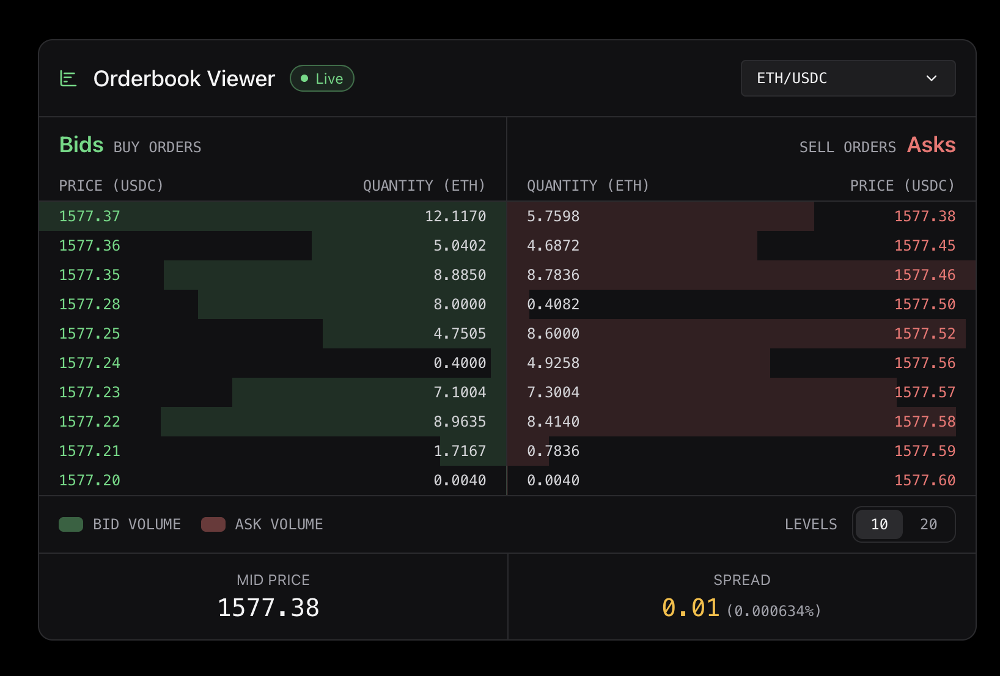
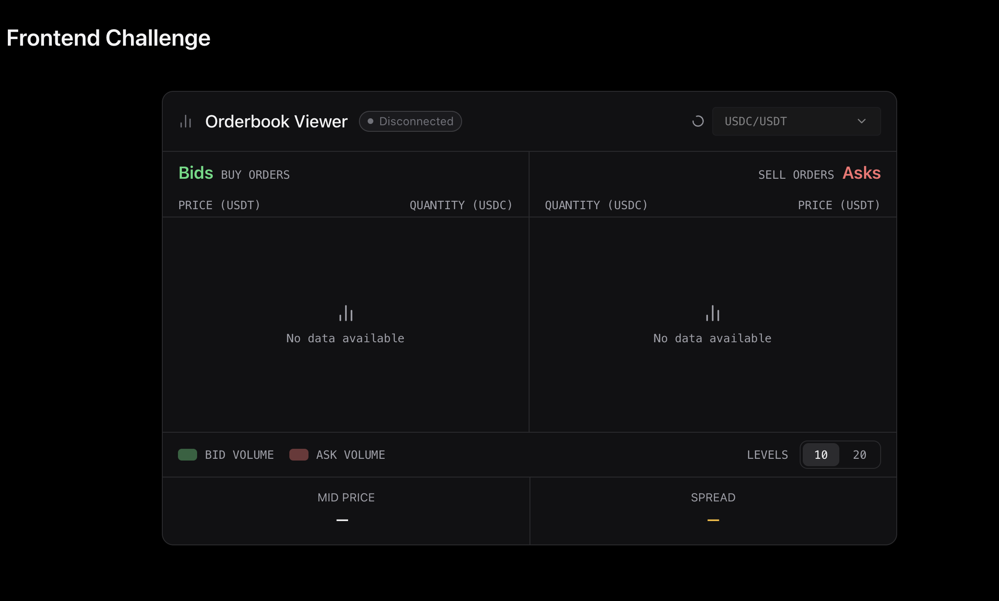
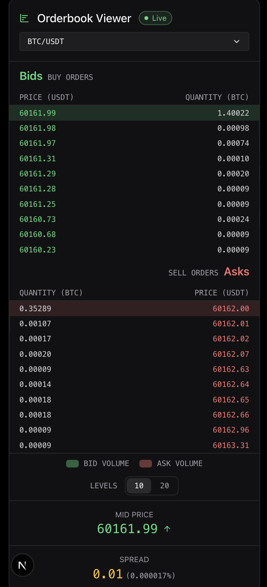
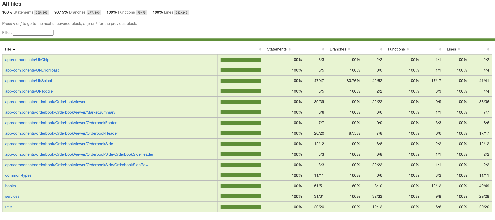

# Orderbook Viewer

A real-time cryptocurrency orderbook built with Next.js, TypeScript, and WebSocket. Displays live bid/ask levels for multiple trading pairs with a 2-second render throttle to prevent UI flicker.

---

### Live orderbook



### Empty state with tickers loading



### Mobile view



### Unit test coverage



---

## Features

- Live orderbook via Binance WebSocket stream
- 2-second render throttle — smooth UI with no flicker
- Auto-reconnect with exponential backoff
- Searchable ticker selector with 5 default pairs
- Toggle between 10 and 20 depth levels
- Mid price with directional arrow and spread
- Responsive layout — side by side on desktop, stacked on mobile
- Connection status chip (live / connecting / error / disconnected)
- Error toast when ticker list fails to load

---

## Tech Stack

### Runtime dependencies

| Package | Version | Why |
|---|---|---|
| `next` | 16 | App Router, server components, standalone Docker output |
| `react` / `react-dom` | 19 | UI layer |
| `framer-motion` | 12 | Mount/unmount animations (`AnimatePresence`) for dropdown and error toast — CSS transitions can't animate elements leaving the DOM |
| `lucide-react` | 1 | Tree-shakable icon set — only the icons used are included in the bundle |

### Dev dependencies

| Package | Why |
|---|---|
| `typescript` | Static typing, zero `any` |
| `tailwindcss` | Utility-first CSS with custom design tokens via CSS variables |
| `jest` + `jest-environment-jsdom` | Test runner with browser-like DOM environment |
| `ts-jest` | TypeScript support in Jest without a separate compile step |
| `@testing-library/react` | Component tests from the user's perspective |
| `@testing-library/user-event` | Realistic user interaction simulation (click, type) |
| `@testing-library/jest-dom` | Custom matchers (`toBeInTheDocument`, `toHaveAttribute`, etc.) |
| `jest-websocket-mock` | Mock WebSocket server for testing `useOrderbookStream` in isolation |
| `eslint-plugin-unused-imports` | Automatically removes unused imports on `--fix` |
| `eslint-plugin-import` | Enforces alphabetical import order |
| `eslint-config-prettier` | Disables ESLint rules that conflict with Prettier formatting |

---

## Getting Started

```bash
npm install
npm run dev
```

Open [http://localhost:3000](http://localhost:3000).

```bash
# Run tests
npm test

# Run tests with coverage
npm test -- --coverage
```

---

## Docker

**Prerequisites:** [Docker Desktop](https://www.docker.com/products/docker-desktop/) installed and running.

```bash
docker build -t orderbook-challenge .
docker run -p 3000:3000 orderbook-challenge
```

Open [http://localhost:3000](http://localhost:3000).

---

## Architecture

### Folder structure

```
orderbook-viewer/
├── app/
│   ├── page.tsx                        # async server component — fetches tickers
│   ├── layout.tsx
│   └── globals.css                     # CSS variables (design tokens) + Tailwind
├── app/components/
│   ├── UI/                             # generic, reusable components
│   │   ├── Chip/                       # connection status badge
│   │   ├── ErrorToast/                 # dismissable error notification
│   │   ├── Select/                     # base select + searchable select
│   │   └── Toggle/                     # button group toggle
│   └── orderbook/
│       └── OrderbookViewer/            # feature components
│           ├── OrderbookViewer.tsx     # orchestrator (client component)
│           ├── OrderbookHeader/
│           ├── OrderbookSide/
│           │   ├── OrderbookSideHeader/
│           │   └── OrderbookSideRow/
│           ├── OrderbookFooter/
│           └── MarketSummary/
├── hooks/
│   └── useOrderbookStream.ts           # WebSocket + throttle + reconnect
├── services/
│   └── marketDataService.ts            # Binance API calls + URL builders
├── utils/
│   └── utils.ts                        # pure functions: sort, parse, mid, spread
├── common-types/
│   └── orderbook.ts                    # shared TypeScript types and enums
├── __mocks__/
│   └── framer-motion.tsx               # global Jest mock
├── Dockerfile
├── .dockerignore
└── next.config.ts                      # standalone output for Docker
```

UI components live under `UI/` and are intentionally generic — no orderbook-specific logic. Feature components live under `orderbook/` and can reference domain types freely. `hooks/`, `services/`, and `utils/` are kept separate to make the data layer independently testable without rendering anything.

### Component tree

```
app/page.tsx                  (async server component — fetches tickers)
└── OrderbookViewer           (client component — orchestrates everything)
    ├── useOrderbookStream     (hook — WebSocket + 2s throttle + reconnect)
    ├── OrderbookHeader        (title, connection status, ticker selector)
    ├── OrderbookSide × 2     (bid table / ask table)
    │   ├── OrderbookSideHeader
    │   └── OrderbookSideRow × N
    ├── MarketSummary          (mid price + directional arrow + spread)
    └── OrderbookFooter        (volume legend + levels toggle)
```

### Data flow

```
Binance REST API
  → page.tsx (server, cached 24h)
    → tickersInfo prop
      → OrderbookViewer
          → useOrderbookStream
              → WebSocket (Binance depth stream)
                  → ref (no render on every message)
                    → setInterval flush every 2s
                      → React state → UI
```

---

## Key Design Decisions

### Data & API Layer

#### WebSocket over polling

The Binance depth stream endpoint (`@depth`) uses a push model — data arrives as soon as it changes. Polling the REST depth endpoint every 1-2 seconds would work but introduces two problems: latency (you wait up to the poll interval for an update) and unnecessary load on the API. WebSocket eliminates both.

If polling had been chosen instead, the following techniques would mitigate its downsides:

- **Jitter** — add a random offset to each interval (`1000 + Math.random() * 500ms`) so multiple clients starting simultaneously don't all hit the API at the same instant (thundering herd)
- **Exponential backoff with jitter** — on 429 or 5xx responses, wait `Math.min(base * 2^attempt, max) + random` before retrying
- **AbortController** — cancel the in-flight request before starting the next tick to avoid accumulating stalled requests
- **Visibility API** — pause polling when `document.visibilityState === 'hidden'` and resume on `visibilitychange` to avoid burning requests while the user isn't looking

#### Ticker list: server-side filtering + top 5 pinned + client-side search

The Binance `GET /api/v3/exchangeInfo` endpoint does not support filtering by quote asset on the server — it returns all symbols. The request was narrowed as much as possible via query parameters (`symbolStatus=TRADING`, `showPermissionSets=false`, `permissions=SPOT`) to reduce response size, and the remaining filtering (USDT pairs only) was done in memory on the server.

The ideal ranking would use `GET /api/v3/ticker/24hr` to sort pairs by `quoteVolume` and always surface the most traded pairs. This was out of scope — the response includes every symbol and parsing/sorting it server-side adds complexity without enough benefit given that top pairs rarely change. Instead, 5 well-known pairs are hardcoded at the top and the rest are sorted alphabetically.

On the client, a `SearchableSelect` component filters the list in memory as the user types — no additional API calls needed.

#### SPOT filter on ticker fetch

The Binance exchange info request includes `permissions=SPOT`, which limits results to spot trading pairs (direct buy/sell). This excludes futures, margin, and other derivative markets — exactly what a standard orderbook viewer needs.

#### No TanStack Query

There is no client-side data fetching in this app, so TanStack Query would have nothing to manage:

- **Tickers** are fetched server-side in `page.tsx` and passed down as props — no client fetch, no cache to manage
- **Orderbook** arrives via WebSocket push — it's a stream, not a query, and TanStack Query has no built-in model for it
- **Filtering** happens in memory on the client from the already-loaded ticker list — no additional requests

Adding TanStack Query (~165KB) would introduce significant bundle weight with zero benefit.

#### Price and quantity precision from tick size

Binance returns `tickSize` (for price) and `stepSize` (for quantity) as strings like `"0.01"` or `"0.00001"`. The number of decimal places is derived by finding the position of `"1"` relative to `"."`:

```ts
Math.max(0, tickSize.indexOf("1") - tickSize.indexOf("."));
```

`Math.max(0, ...)` guards against tick sizes like `"1.00000000"` where the formula would return -1, which would crash `toFixed()`.

#### Auto-reconnect with exponential backoff

Binance closes WebSocket connections after 24 hours. When `onclose` fires (for any reason other than a deliberate disconnect), the hook schedules a reconnect using exponential backoff: `Math.min(1000 * 2^retry, 10000)`. This caps the wait at 10 seconds and avoids hammering the server on repeated failures. If the connection drops due to an error, the `Error` status is preserved through the reconnect cycle and not overwritten by `Disconnected`.

#### Error handling strategy

Two error surfaces are handled:

- **Ticker fetch failure** — `getTickersInfo()` can fail if the Binance REST API is down. The server passes a `hasError` flag to `OrderbookViewer`, which shows a dismissable `ErrorToast`. The app still renders using fallback tickers (`TOP_TICKERS`) so the user can interact with the orderbook even if the full list didn't load.
- **WebSocket errors** — `onerror` sets the status to `Error`, clears the orderbook, and calls `close()` to trigger the reconnect cycle. Each `OrderbookSide` shows an empty state with a status-aware message (e.g. "No data available — Connection error").

---

### Performance & Rendering

#### 2-second render throttle (anti-flicker)

Each WebSocket message would trigger a re-render at 1 message/second. Instead, every incoming message is stored in a `ref` (no render), and a `setInterval` flushes the latest snapshot to state every 2 seconds. This eliminates flicker while always showing the most recent data.

#### Row keys by position index

Orderbook rows are keyed by their position index (`key={index}`) rather than by price. If price were used as the key, React would destroy and recreate the DOM node every time a price changed — causing visible flicker. With a stable index key, React updates the content of the existing row in place, which is both faster and visually smooth.

#### No `React.memo`

`React.memo` on `OrderbookSide` was considered to prevent re-renders when only one side changes. It was not added because the 2-second throttle already limits state updates to one per 2 seconds — both sides always update together from the same `orderbookData` object. Memoization would add complexity without measurable benefit.

#### Sorting raw levels before rendering

Binance does not guarantee sort order in the depth snapshot response. Bids are sorted descending (highest price first) and asks ascending (lowest price first) before being passed to the UI. Without this step, prices appear in random order — which was a visible bug during development.

#### `closed` flag in `useOrderbookStream`

The `useEffect` cleanup sets a local `closed = true` flag before closing the WebSocket. The `onclose` handler checks this flag before scheduling a reconnect — if `closed` is true, it returns immediately. Without this guard, the reconnect timer would fire after the component unmounts, calling `setState` on an unmounted component and potentially opening a new WebSocket connection that can never be cleaned up.

#### NaN as a sentinel value for "no price yet"

`NaN` is used as the initial value for `bestBid`, `bestAsk`, and `lastMidPrice` instead of `0` or `null`. This is intentional:

- `NaN` comparisons always return `false` (`NaN > NaN`, `NaN < NaN`, `NaN > 50000` — all false). This means going from "no data" to the first real price does **not** trigger a direction arrow, which is the correct behavior — there is no previous price to compare against.
- `isNaN()` checks in `MarketSummary` display `"—"` instead of a number when mid price or spread are not yet available, keeping the UI clean during the connecting phase.
- Using `0` would be semantically wrong — a price of zero is a valid (if extreme) market condition. `NaN` unambiguously means "absent".

---

### Architecture & Patterns

#### `"use client"` boundary

`OrderbookViewer` is the explicit boundary between the server and client in the App Router model. Everything above it (`page.tsx`) runs on the server — no hooks, no WebSocket, no browser APIs. Everything below it runs on the client. Placing the boundary at `OrderbookViewer` means the ticker fetch stays server-side (cached, shared) while all real-time logic stays client-side.

#### Props over Context

The component tree is shallow and data flows in one direction. Context would add indirection without benefit at this scale.

#### Reusable UI components without over-parameterization

Common UI elements (`Toggle`, `Chip`, `Select`, `SearchableSelect`, `ErrorToast`) were extracted into reusable components to avoid duplication across the app. However, none of them were made fully generic or heavily parameterized — at this scale it would have been overkill. The components cover exactly the use cases they need to serve today.

#### Toggle accepts `string[]` instead of a generic type

The `Toggle` component accepts `string[]` and the conversion responsibility falls on the consumer — `OrderbookFooter` converts `number[]` to strings via `levelsOptions.map(String)`. Making Toggle generic (`<T extends string | number>`) would add type complexity without real benefit at this scale, since the component only needs to compare and render values.

---

### UX Decisions

#### Connection status chip

WebSocket connection state is not visible to the user by default — the browser handles it silently. A `Chip` component with four states (live / connecting / error / disconnected) makes the stream state explicit, so the user always knows whether the data they're seeing is live or stale.

#### Depth levels toggle (10 / 20)

Two level options give the user control over information density. 10 levels is the default for a clean view; 20 levels provides deeper market context. Adding more options (50, 100) was considered but not included — the Binance stream supports them but it increases data volume and rendering work without proportional UX benefit at this scale.

#### Ticker selector loading state and result count

While the ticker list is being fetched server-side, the dropdown trigger is disabled (`disabled` prop) and a `Loader2` spinner appears next to it. This prevents the user from opening an empty or incomplete list and makes the loading state explicit.

Once loaded, the `SearchableSelect` caps the visible options to `maxVisible={5}` at a time. When the search filter returns more matches than can be displayed, a footer note shows `"Showing 5 of N tickers — refine your search"`. This tells the user exactly how many results exist and prompts them to narrow their query rather than scrolling through a long list.

#### SearchableSelect over native `<select>`

The native `<select>` element doesn't support filtering or searching, which is a poor UX when the list contains hundreds of trading pairs. A custom component gives full control over keyboard interaction, filtering, and accessibility without depending on a UI component library.

#### Depth bars: quantity vs cumulative total

Two strategies were considered for the background bar width:

1. **Individual quantity** (`level.quantity / maxQuantity`) — bar width reflects the size of each individual order. Easy to compare levels at a glance.
2. **Cumulative total** (`level.total / maxTotal`) — bar width reflects depth up to that level, growing monotonically. Better for visualizing total liquidity available.

The final implementation uses **individual quantity** because it makes it easier to spot large individual orders (walls) without needing to interpret the cumulative curve. The `total` field is still computed and stored in each level in case this behavior needs to be changed.

#### Direction arrow persists on ticker change

The mid price direction arrow keeps the last known direction until the price changes again — matching the behavior seen on most exchanges. Resetting it to nothing when the price stays the same would be less informative, not more.

There is one known edge case: if you switch from a ticker with a high price (e.g. BTC) to one with a lower price (e.g. ETH), the arrow will briefly show "down" for up to 2 seconds (one throttle cycle) even if ETH is actually rising. The fix would be to reset `lastMidPrice` when the ticker changes, but given the 2-second window and low visual impact this was left as a known issue.

#### Direction arrow and useEffect dependency on orderbookData

The `useEffect` that drives the direction arrow depends on `midPrice`, which is derived from `orderbookData`. Since `orderbookData` updates every 2 seconds (the throttle interval), the effect runs every 2 seconds even when the mid price hasn't changed. The effect body is trivial (one comparison, one conditional `setState`), so the performance impact is negligible.

#### Anti-shift strategy

Layout shift was prevented through a combination of approaches:

- **Fixed row height** (`h-6`) on every orderbook row — the layout doesn't reflow when data arrives or levels change
- **Monospaced font with `tabular-nums`** — all price and quantity digits have equal width so changing values never shift surrounding text
- **Empty rows rendered** — when fewer than 10/20 levels are available, empty placeholder rows are rendered at full height to keep the table dimensions stable
- **WebSocket loading states** — while connecting or reconnecting, the empty state (`No data available`) is shown inside a fixed-height container rather than collapsing the layout

One intentional exception: switching between 10 and 20 levels causes the container to grow or shrink. This is a deliberate design decision — the shift is triggered by an explicit user action so it is expected, not surprising. Alternatives were considered:

- **Fix the container height to 20 rows always** — eliminates the shift but wastes space when showing 10 levels
- **Spinner during transition** — adds perceived latency to an instant operation
- **Vertical scroll inside a fixed container** — keeps the height stable but hides levels below the fold, reducing the value of the 20-level view

None of these alternatives offered a better trade-off. The shift is minor, immediate, and user-initiated — not worth the added complexity.

#### Responsive layout

The layout switches between two modes at the `sm` breakpoint (640px):

- **Desktop** — bids and asks side by side (`grid-cols-2`), bids on the left (price → quantity), asks mirrored on the right (quantity → price). This matches the standard exchange layout.
- **Mobile** — single column, stacked vertically. Asks appear first (top), then bids (bottom), matching the vertical convention used by most mobile trading apps where the sell wall is at the top.

The mid price and spread also stack vertically on mobile instead of side by side.

---

### Accessibility

#### Semantic table with ARIA roles

Semantically, `<table>`, `<thead>`, `<tbody>`, `<tr>`, `<th>`, and `<td>` would be the correct HTML elements — native HTML is always preferred over ARIA roles. However, the `position: absolute` depth bars that overlay each row are not compatible with table CSS constraints, which are too restrictive for this kind of layout. Divs with `role="table"`, `role="row"`, `role="cell"`, and `role="columnheader"` provide the same accessibility semantics without the layout limitations.

---

### Styling & Design

#### Design tokens via CSS variables + Tailwind

All theme colors are defined as CSS variables in `globals.css` using an `ov-` prefix (e.g. `--ov-bid`, `--ov-ask`, `--ov-surface`, `--ov-border`) and exposed as Tailwind utilities (`text-ov-bid`, `bg-ov-surface`, etc.) via `tailwind.config`. This means:

- **One source of truth** — changing the color scheme means editing `globals.css` only
- **Semantic naming** — components reference intent (`text-ov-bid`) not implementation (`text-green-400`), so the meaning survives a redesign
- **Dark mode ready** — swapping CSS variable values at `:root` or a `[data-theme]` selector is all that's needed to support themes

#### UI design with Claude

The visual design and Tailwind utility classes were generated with the help of Claude (Anthropic's AI). This sped up the styling process significantly — design tokens, color scheme, spacing, and responsive layout were iterated quickly without writing CSS from scratch. The component logic, architecture, and business decisions were written independently.

#### Framer Motion for mount/unmount animations

CSS transitions cannot animate elements that are added to or removed from the DOM. `AnimatePresence` from Framer Motion handles fade in/out for the `ErrorToast` (appears on error, disappears on dismiss) and the `SearchableSelect` dropdown (opens/closes). This avoids manual animation state management while keeping the bundle impact minimal.

---

### Testing

#### Jest + React Testing Library over snapshot or table-driven tools

Jest + RTL tests behavior from the user's perspective (what renders, what's accessible, what happens on interaction) rather than implementation details. Snapshot testing would couple tests to markup structure. RTL's queries (`getByRole`, `getByLabelText`) also double as accessibility checks — if a role or label is missing, the test fails.

#### Unit tests

Tests were written for several reasons beyond the challenge bonus requirement:

- **Real-time behavior is hard to verify visually** — the 2-second throttle, reconnect logic, and status transitions are invisible in the UI. Tests make these behaviors explicit and verifiable.
- **Accessibility as a byproduct** — RTL queries like `getByRole` and `getByLabelText` fail if ARIA roles or labels are missing. Writing tests enforced correct semantics across every component.
- **Refactor safety** — the WebSocket hook and utility functions are pure enough to test in isolation. Having tests means the data layer can be changed confidently without breaking the UI.

---

## What I'd Improve

- **Incremental orderbook diff** — apply depth update deltas instead of replacing the full snapshot on every flush, reducing the rendering work per tick
- **Accessible ticker search** — add keyboard navigation (arrow keys, Home/End) to the searchable select following the ARIA combobox pattern
- **Dynamic top tickers** — rank the default pairs by `quoteVolume` from `GET /api/v3/ticker/24hr` so the list stays relevant without manual updates

## Known Issues

- **Direction arrow on ticker switch** — when switching from a high-price ticker (e.g. BTC) to a lower-price ticker (e.g. ETH), the arrow briefly shows "down" for up to 2 seconds regardless of ETH's actual price direction. This is because `lastMidPrice` is not reset when the ticker changes. The fix is straightforward but the visual impact is minimal given the 2-second throttle window.
